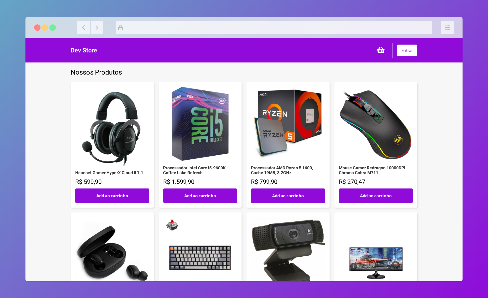

# State Management With Context API
This project is a simple shopping cart webapp, that uses Context API + React Hooks for global state management. 

## How to run?

Install the dependencies   
`yarn`

Start the project  
`yarn start`

